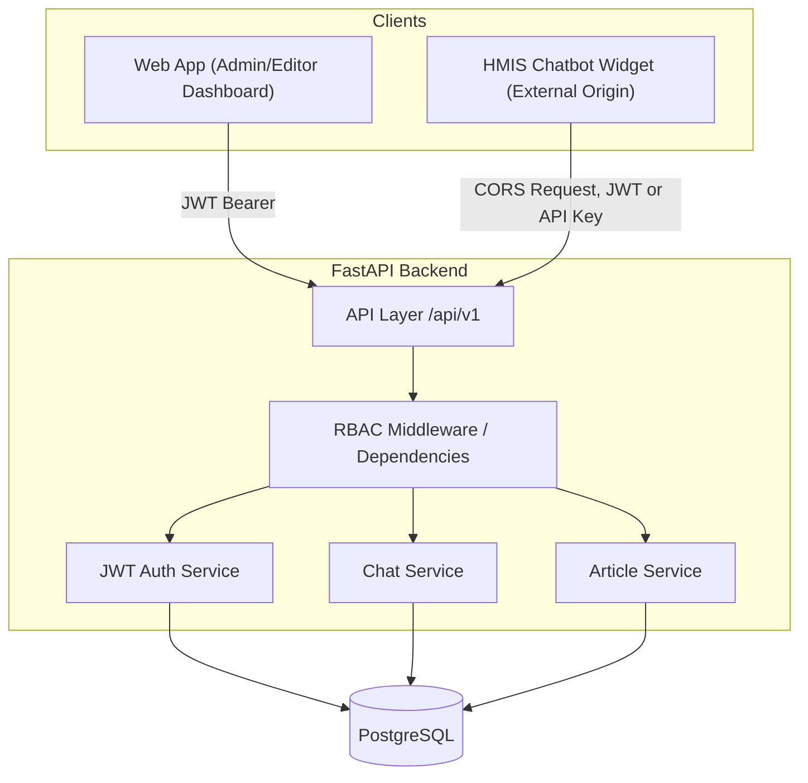

# Architecture — HealthTech KB + Chatbot System

## 1. Overview

The system is a Knowledge Base (KB) platform for a healthtech product (HMIS),
paired with an embeddable chatbot widget that external applications (like the
HMIS itself) can load to let staff query KB content conversationally.

Components:

- **Web App** — React/Vite admin + reader dashboard (create/edit articles, manage users, search)
- **HMIS Chatbot Widget** — lightweight embeddable client, loaded from a _different origin_ than the KB web app
- **FastAPI Backend** — single API serving both the web app and the widget
- **PostgreSQL** — persistence for articles, users, chat logs/messages

## 2. Scope

### In scope (this capstone)

- Article CRUD with categories/tags, authored by editors/admins
- Role-based access control across three roles: `admin`, `editor`, `viewer`
- JWT-based authentication for the web app
- A chat endpoint (`/api/v1/chat/`) the widget calls cross-origin, with chat
  history persisted per session/user
- Explicit CORS allowlist so only the known widget/web origins can call the API
- API contract published as a Postman/OpenAPI collection
- Password hashing (bcrypt), basic rate limiting on `/auth/login`, audit
  logging of admin actions

### Out of scope (for now / future roadmap)

- Multi-tenant support (multiple healthcare orgs on one deployment)
- Article versioning / revert history
- Offline mode / PWA caching
- Multi-language content (English/Swahili)
- Production-grade LLM-backed semantic search (current chat uses KB
  keyword/full-text matching, with room to swap in an LLM API later)
- SSO / third-party auth providers (Auth0, Firebase) — plain JWT only for MVP

### Primary users

- **Admin** — engineering/product owner managing users and publishing content
- **Editor** — support/clinical SME drafting and updating articles
- **Viewer** — support/clinical staff and the HMIS widget's end users, read-only

## 3. System Context



Every request into the API layer passes through the RBAC dependency before
reaching a service — auth is not optional per-route, it's a shared gate.

## 4. RBAC Model

### 4.1 Roles & permissions matrix

| Action                           | Viewer | Editor | Admin |
| -------------------------------- | :----: | :----: | :---: |
| Read published articles          |   ✅   |   ✅   |  ✅   |
| Search / use chatbot             |   ✅   |   ✅   |  ✅   |
| Submit article feedback          |   ✅   |   ✅   |  ✅   |
| Create / edit draft articles     |   ❌   |   ✅   |  ✅   |
| Publish / unpublish articles     |   ❌   |   ❌   |  ✅   |
| Delete articles                  |   ❌   |   ❌   |  ✅   |
| View draft (unpublished) content |   ❌   |   ✅   |  ✅   |
| Manage users / assign roles      |   ❌   |   ❌   |  ✅   |
| View analytics / audit logs      |   ❌   |   ❌   |  ✅   |

### 4.2 How it's enforced

- `role` is a string field on `users` (`admin` / `editor` / `viewer`),
  embedded as a claim in the JWT at login (`core/security.py`).
- `api/deps.py` exposes layered dependencies:
  - `get_current_user` — decodes the JWT, loads the user, 401 if invalid/expired
  - `require_role(*roles)` — a dependency factory returning a callable that
    403s if `current_user.role not in roles`
- Routes declare the minimum role inline, e.g.:
  ```python
  @router.post("/articles", dependencies=[Depends(require_role("editor", "admin"))])
  @router.post("/articles/{id}/publish", dependencies=[Depends(require_role("admin"))])
  @router.delete("/users/{id}", dependencies=[Depends(require_role("admin"))])
  ```
- The widget's chat endpoint (`/api/v1/chat/`) only requires _authentication_,
  not a specific role — any logged-in role (including viewer) can chat.
- Drafts are filtered at the query layer: `ArticleService.list()` excludes
  `status != "published"` unless the caller is `editor`/`admin`.
- All role checks live in one place (`api/deps.py`) — no route should
  hand-roll its own role comparison, to avoid drift between endpoints.

### 4.3 Audit logging

Admin-only actions (publish, delete, user/role changes) write a row to an
`audit_log` table: `actor_id`, `action`, `target_type`, `target_id`,
`timestamp`. This satisfies the security checklist requirement to record all
admin actions.

## 5. CORS Configuration

The widget is embedded on a different origin than the KB web app, so CORS
must be explicit rather than wildcarded:

```python
allow_origins = [
    "http://localhost:3000",       # KB web app (dev)
    "http://localhost:5173",       # Vite dev server
    "https://hmis-widget.example.com",  # HMIS mockup / widget host (prod)
]
```

- `allow_credentials=True` only if the widget needs cookies; if the widget
  authenticates via a bearer token in the `Authorization` header instead,
  credentials-mode CORS isn't required — prefer the token approach to keep
  the CORS policy simpler and avoid cookie/session complexity across origins.
- No wildcard (`*`) origins in any environment that also allows credentials.

## 6. API Contract (Core Endpoints)

Full contract lives in `docs/api-collection.json` (Postman/OpenAPI). Summary:

| Endpoint                        | Method | Auth           | Caller           |
| ------------------------------- | ------ | -------------- | ---------------- |
| `/api/v1/auth/login`            | POST   | none           | Web App          |
| `/api/v1/users`                 | POST   | admin          | Web App          |
| `/api/v1/articles`              | GET    | any role       | Web App / Widget |
| `/api/v1/articles`              | POST   | editor, admin  | Web App          |
| `/api/v1/articles/{id}/publish` | POST   | admin          | Web App          |
| `/api/v1/chat/`                 | POST   | any role       | Widget           |
| `/api/v1/chat/history`          | GET    | any role (own) | Widget / Web App |

## 7. Security

- JWT authentication, short-lived access tokens (target: 8h max session)
- Passwords hashed with bcrypt (passlib)
- Role-based access enforced via shared FastAPI dependencies (§4.2)
- Rate limiting on `/auth/login` (max 5 attempts / 10 min) to blunt brute force
- Parameterized queries via SQLAlchemy ORM — no raw string SQL
- Explicit CORS allowlist (§5), never wildcarded with credentials
- Audit log for all admin actions (§4.3)

## 8. Flow — Widget Chat Request

1. Widget sends a chat request cross-origin → Backend (allowed via CORS)
2. Backend authenticates the caller (JWT) and applies RBAC (any authenticated role)
3. Chat service queries relevant articles and composes a response
4. Response returned to widget
5. Chat log + message persisted to `CHAT_LOGS` / `CHAT_MESSAGES`
