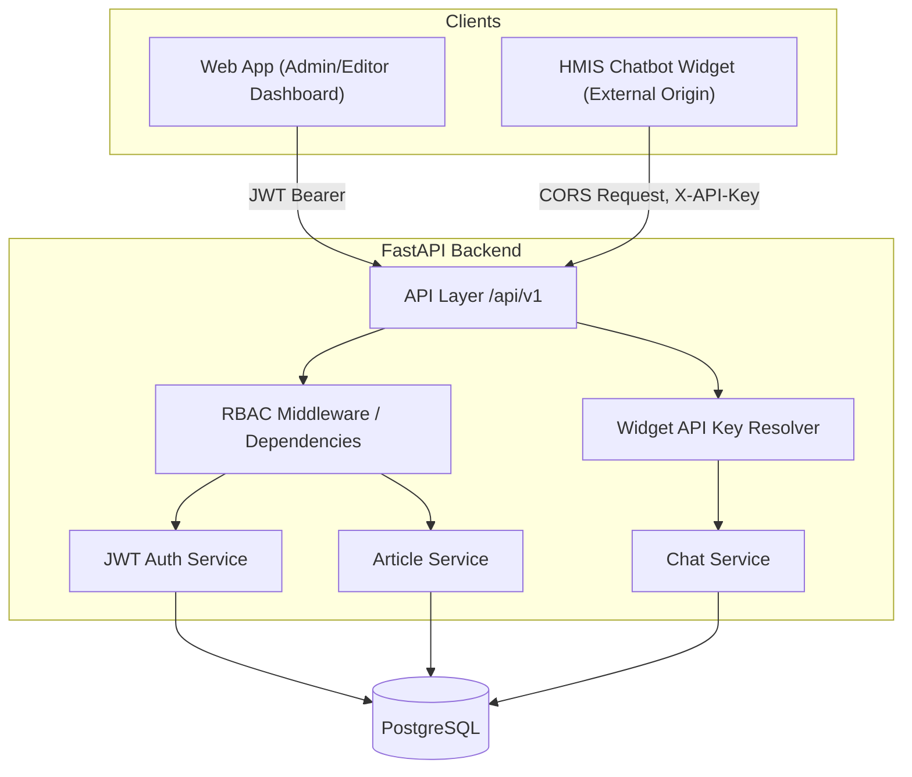

# Architecture — HealthTech KB + Chatbot System

## 1. Overview

The system is a Knowledge Base (KB) platform for a healthtech product (HMIS),
paired with an embeddable chatbot widget that external applications (like the
HMIS itself) can load to let staff query KB content conversationally.

Components:

- **Web App** — React/Vite admin + reader dashboard (create/edit articles, manage users, search)
- **HMIS Chatbot Widget** — lightweight embeddable client, loaded from a _different origin_ than the KB web app, authenticated by a per-host API key rather than a user JWT
- **FastAPI Backend** — single API serving both the web app and the widget
- **PostgreSQL** — persistence for articles, users, chat logs/messages, audit logs
- **Alembic** — schema migrations; the backend no longer auto-creates tables
  on startup (`Base.metadata.create_all` has been removed in favor of
  `alembic upgrade head`)

## 2. Scope

### In scope (this capstone)

- Article CRUD with categories/tags, authored by editors/admins
- Role-based access control across three roles: `admin`, `editor`, `viewer`
- JWT-based authentication for the web app
- API-key-based authentication for the embedded widget, resolved to a host
  name via `resolve_widget_host()`
- A chat endpoint (`/api/v1/chat/`) the widget calls cross-origin, with chat
  history persisted per session/user (or per session/widget-host, for
  unauthenticated widget end users with no user account)
- Explicit, per-caller-type CORS allowlists so only known widget/web origins
  can call the API
- API contract published as a Postman/OpenAPI collection (`docs/api-collection.json`)
- Password hashing (bcrypt), audit logging of admin actions

> **Note:** basic rate limiting on `/auth/login`, originally listed as
> in-scope below, has not been implemented yet and is deferred — see §7.

### Out of scope (for now / future roadmap)

- Multi-tenant support (multiple healthcare orgs on one deployment)
- Article versioning / revert history
- Offline mode / PWA caching
- Multi-language content (English/Swahili)
- Production-grade LLM-backed semantic search (current chat uses a
  placeholder echo reply; KB keyword/full-text retrieval is planned, with
  room to swap in an LLM API later)
- SSO / third-party auth providers (Auth0, Firebase) — plain JWT only for the
  dashboard MVP; the widget uses a simpler per-host API key, not full SSO
- Login rate limiting (deferred — see §7)

### Primary users

- **Admin** — engineering/product owner managing users and publishing content
- **Editor** — support/clinical SME drafting and updating articles
- **Viewer** — support/clinical staff, read-only
- **Widget end users** — HMIS staff interacting through the embedded widget;
  authenticated at the host-app level via API key, not as individual KB
  users with their own role

## 3. System Context



Dashboard requests pass through the RBAC dependency chain (JWT → role checks)
before reaching a service. Widget requests to `/api/v1/chat/` instead pass
through the widget API-key resolver — there is no role check on that path,
since widget callers aren't tied to a KB user account.

## 4. RBAC Model

### 4.1 Roles & permissions matrix

| Action                           | Viewer | Editor | Admin |
| -------------------------------- | :----: | :----: | :---: |
| Read published articles          |   ✅   |   ✅   |  ✅   |
| Search / use chatbot             |   ✅   |   ✅   |  ✅   |
| Submit article feedback          |   ✅   |   ✅   |  ✅   |
| Create / edit draft articles     |   ❌   |   ✅   |  ✅   |
| Publish / archive articles       |   ❌   |   ❌   |  ✅   |
| Delete articles                  |   ❌   |   ❌   |  ✅   |
| View draft (unpublished) content |   ❌   |   ✅   |  ✅   |
| Manage users / assign roles      |   ❌   |   ❌   |  ✅   |
| View analytics / audit logs      |   ❌   |   ❌   |  ✅   |

This matrix applies to dashboard users authenticated via JWT. Widget callers
(API-key-authenticated) aren't a row in this table — they have no `role` and
only ever reach the chat endpoint (§4.4).

### 4.2 How it's enforced (dashboard / JWT)

- `role` is a string field on `users` (`admin` / `editor` / `viewer`),
  embedded as a claim in the JWT at login (`core/security.py`).
- `core/security.py` defines a role hierarchy rather than a flat set:
  `ROLE_RANK = {"viewer": 1, "editor": 2, "admin": 3}`, with a
  `get_role_rank(role)` helper.
- `api/deps.py` exposes layered dependencies:
  - `get_current_user` — decodes the JWT, loads the user, 401 if invalid/expired.
    If a token predates the role claim (issued before this feature shipped),
    `get_current_user` falls back to looking up the role from the database
    rather than rejecting the token.
  - `require_role_hierarchy(min_role: str)` — a dependency factory that 403s
    if the current user's role rank is below `min_role`'s rank. This is the
    **only** role-check mechanism in the codebase — a flat `require_role(*roles)`
    set-membership variant was considered and dropped in favor of this single
    consistent enforcement path.
- Routes declare the minimum role inline, e.g.:

```python
  @router.post("/articles/", dependencies=[Depends(require_role_hierarchy("editor"))])
  @router.delete("/articles/{id}", dependencies=[Depends(require_role_hierarchy("admin"))])
  @router.delete("/users/{id}", dependencies=[Depends(require_role_hierarchy("admin"))])
```

Publishing/archiving is enforced as an **in-handler check** inside
`PUT /articles/{id}` rather than a separate `/articles/{id}/publish` route
(see §6) — status transitions to `published` or `archived` require admin;
other field edits (title, content, category, tags, draft ↔ under_review)
are allowed for editor and admin.

- Drafts are filtered at the query layer: the articles list/detail endpoints
  exclude `status != "published"` unless the caller is `editor`/`admin`.
- All role checks live in one place (`api/deps.py`) — no route hand-rolls its
  own role comparison, avoiding drift between endpoints.

### 4.3 Audit logging

Admin-sensitive actions write a row to the `audit_logs` table: `actor_id`,
`action`, `target_type`, `target_id`, `timestamp`. Currently covers:

- User role changes and user deletion
- Article updates and article deletion

> **Note:** article `action` values presently describe the change inline
> (e.g. `"update_article"`), rather than splitting a fixed `action` category
> from a separate `details` field. A `details` column may be added later to
> hold before/after values (e.g. role or status transitions) separately from
> the action name, keeping `action` cleanly filterable. Not yet implemented.

### 4.4 Widget authentication (API key, not role-based)

Unlike the dashboard, the widget doesn't authenticate as an individual KB
user with a role. Instead:

- The chat endpoints (`/api/v1/chat/`, `/api/v1/chat/history`) accept an
  `X-API-Key` header. `core/security.py`'s `resolve_widget_host(api_key)`
  looks the key up against `settings.widget_api_keys_map`
  (`WIDGET_API_KEYS` env var, format `host_name:key,host_name2:key2`) and
  returns the calling host's name, or `None` if the key is unrecognized.
- `api/v1/endpoints/chat.py`'s `get_chat_caller` dependency checks
  `X-API-Key` first; if present and valid, the request proceeds as an
  authenticated widget host with no associated user (`ChatLog.user_id` is
  `NULL`, `widget_source` set to the _resolved_ host name — never trusted
  from the client-supplied request body).
- If no `X-API-Key` is present, `get_chat_caller` falls back to JWT
  (`Authorization: Bearer`), so a dashboard user can also exercise the chat
  endpoint under their own account for testing.
- If neither credential is present, or the API key is invalid, the request
  is rejected with 401.
- There is no role check on this path — any valid widget API key or any
  valid JWT (regardless of role) can use chat, matching §4.1's "any role"
  entry for chatbot use.

## 5. CORS Configuration

Two separate origin allowlists exist, reflecting the two caller types,
dispatched by path prefix in `core/cors.py`'s `DualOriginCORSMiddleware`:

- **`DASHBOARD_ORIGINS`** — the React web app. Credentialed (JWT bearer),
  `Authorization` header allowed. Applied to all paths except those under
  the widget prefix.
- **`WIDGET_ORIGINS`** — the embedded HMIS widget, matched by requests
  under the `/api/v1/chat` path prefix (`WIDGET_PATH_PREFIX` in
  `core/cors.py` — must be kept in sync with wherever the chat router is
  actually mounted in `main.py`). No-credentials mode; `X-API-Key` header
  allowed instead of `Authorization`.

```python
DASHBOARD_ORIGINS = "http://localhost:5173"
WIDGET_ORIGINS = "http://localhost:8080"
WIDGET_API_KEYS = "hmis_mock:dev-widget-key-change-me"
```

- `allow_credentials=True` only applies to `DASHBOARD_ORIGINS`;
  `WIDGET_ORIGINS` runs without credentials, relying on the `X-API-Key`
  header (now actually validated by `chat.py`'s `get_chat_caller`, per §4.4)
  rather than cookies or bearer tokens.
- No wildcard (`*`) origins in any environment that also allows credentials.
- `assert_no_origin_overlap()` runs at startup and crashes boot immediately
  if `DASHBOARD_ORIGINS` and `WIDGET_ORIGINS` overlap, rather than allowing
  an origin to silently be trusted at the wrong level.

## 6. API Contract (Core Endpoints)

Full contract lives in `docs/api-collection.json` (Postman/OpenAPI). Summary:

| Endpoint                | Method | Auth                                        | Caller           |
| ----------------------- | ------ | ------------------------------------------- | ---------------- |
| `/api/v1/auth/login`    | POST   | none                                        | Web App          |
| `/api/v1/users/`        | GET    | admin                                       | Web App          |
| `/api/v1/users/{id}`    | PUT    | admin                                       | Web App          |
| `/api/v1/users/{id}`    | DELETE | admin                                       | Web App          |
| `/api/v1/articles/`     | GET    | any role (filtered)                         | Web App / Widget |
| `/api/v1/articles/`     | POST   | editor, admin                               | Web App          |
| `/api/v1/articles/{id}` | GET    | any role (filtered)                         | Web App / Widget |
| `/api/v1/articles/{id}` | PUT    | editor, admin (publish/archive: admin only) | Web App          |
| `/api/v1/articles/{id}` | DELETE | admin                                       | Web App          |
| `/api/v1/chat/`         | POST   | X-API-Key (widget) or JWT (any role)        | Widget / Web App |
| `/api/v1/chat/history`  | GET    | X-API-Key (widget) or JWT (any role, own)   | Widget / Web App |
| `/health`               | GET    | none                                        | —                |

> **Note:** publish/unpublish is not a separate `/articles/{id}/publish`
> route — it's a status-field update via the same `PUT /articles/{id}`
> endpoint, with an in-handler check restricting the `published`/`archived`
> transition to admin.

## 7. Security

- JWT authentication, short-lived access tokens (currently 60 minutes, via
  `create_access_token`'s default `expires_delta` in `core/security.py`)
- Widget API-key authentication for chat, resolved via `resolve_widget_host`
  and enforced in `chat.py`'s `get_chat_caller`
- Passwords hashed with bcrypt (passlib)
- Role-based access enforced via shared FastAPI dependencies, hierarchy-based (§4.2)
- Parameterized queries via SQLAlchemy ORM — no raw string SQL
- Explicit, per-caller-type CORS allowlists (§5), never wildcarded with credentials
- Audit log for admin-sensitive actions (§4.3)
- Schema managed via Alembic migrations, not startup auto-create

> **Deferred:** rate limiting on `/auth/login` (target: max 5 attempts / 10
> min) was originally listed as in-scope but has not been implemented. It
> remains a candidate for a later security-hardening pass, pending a decision
> on whether it's required for capstone submission. Note also that the
> widget's API-key endpoint has no comparable rate limiting either.

## 8. Flow — Widget Chat Request

1. Widget sends a chat request cross-origin with an `X-API-Key` header →
   Backend, matched against the `WIDGET_ORIGINS` CORS policy by path prefix
   (`/api/v1/chat`)
2. Backend's `get_chat_caller` dependency validates the API key via
   `resolve_widget_host`; invalid or missing key → 401. No user account or
   role is involved for widget callers.
3. Chat service finds-or-creates a `ChatLog` keyed by `(session_id,
widget_host)` (no `user_id`, since widget end users aren't KB users),
   persists the incoming message
4. A reply is generated and persisted — **currently a placeholder echo**
   (`f"ACK: {message}"`), not real KB-search-based retrieval. This is the
   confirmed scope of the upcoming chat/KB-retrieval sprint.
5. Response returned to widget
6. Chat log + message persisted to `chat_logs` / `chat_messages`
