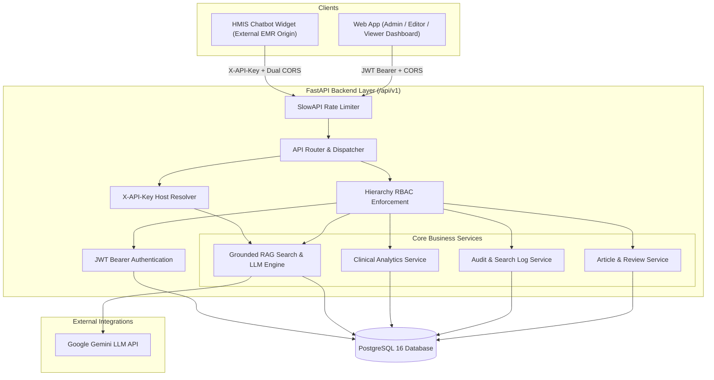
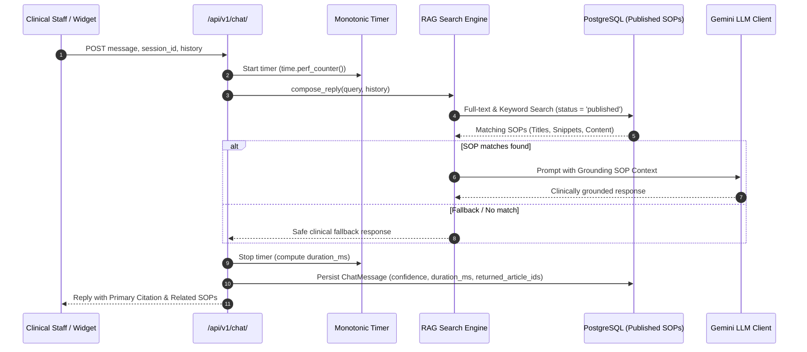

# Architecture Specification — HealthTech Knowledge Base & Decision Support System

## 1. Executive Overview

The **HealthTech Knowledge Base (HealthTech KB)** is an enterprise clinical documentation, governance, and conversational decision-support platform designed for hospital networks and Health Management Information Systems (HMIS). 

### Primary System Components:

1. **Clinical Web Application (React 19 + Vite 8 + Tailwind CSS v4)**:
   - High-contrast clinical reading interface for Standard Operating Procedures (SOPs).
   - Rich Text Authoring environment with real-time formatting, word counters, and reading time estimates.
   - Editorial Review Queue with review aging metrics ("Days Waiting") and inline rejection feedback capture.
   - Administration & Audit console for staff management, activity logs, and satisfaction analytics.
   - Embedded floating clinical decision copilot with rating persistence.

2. **HMIS Embed Widget (Standalone Web Component)**:
   - Lightweight, standalone chat widget (`/widget?apiKey=...`) embeddable into host clinical interfaces (EMR/HMIS) across different origins.
   - Authenticated via host-level `X-API-Key`.

3. **FastAPI Backend Core (Python 3.12 + SQLAlchemy 2.0)**:
   - Strict hierarchical Role-Based Access Control (RBAC).
   - SlowAPI rate limiting against brute-force and request flooding.
   - RAG retrieval pipeline grounded on published hospital SOPs, integrating Google Gemini with full-text fallback.
   - Non-repudiable audit logging for administrative actions.

4. **PostgreSQL 16 Database & Alembic**:
   - Declarative schema migrations managed through Alembic (`alembic upgrade head`).

---

## 2. System Context Diagram

```mermaid
flowchart TD

    subgraph Clients["Clients"]
        WebApp["Web App (Admin / Editor / Viewer Dashboard)"]
        Widget["HMIS Chatbot Widget (External EMR Origin)"]
    end

    subgraph Backend["FastAPI Backend Layer (/api/v1)"]
        API[API Router & Dispatcher]
        Limiter[SlowAPI Rate Limiter]
        AuthSvc[JWT Bearer Authentication]
        WidgetAuth[X-API-Key Host Resolver]
        RBAC[Hierarchy RBAC Enforcement]
        
        subgraph Services["Core Business Services"]
            ArticleSvc[Article & Review Service]
            AuditSvc[Audit & Search Log Service]
            AnalyticsSvc[Clinical Analytics Service]
            RAGSvc[Grounded RAG Search & LLM Engine]
        end
    end

    subgraph External["External Integrations"]
        GeminiAPI["Google Gemini LLM API"]
    end

    DB[(PostgreSQL 16 Database)]

    WebApp -->|JWT Bearer + CORS| Limiter
    Widget -->|X-API-Key + Dual CORS| Limiter
    Limiter --> API

    API --> RBAC
    API --> WidgetAuth

    RBAC --> AuthSvc
    RBAC --> ArticleSvc
    RBAC --> AuditSvc
    RBAC --> AnalyticsSvc
    RBAC --> RAGSvc
    WidgetAuth --> RAGSvc

    RAGSvc --> GeminiAPI
    ArticleSvc --> DB
    AuditSvc --> DB
    AnalyticsSvc --> DB
    RAGSvc --> DB
    AuthSvc --> DB
```

---

## 3. Role-Based Access Control (RBAC) Matrix

Access permissions are enforced strictly via hierarchical role ranks (`viewer: 1` < `editor: 2` < `admin: 3`).

| Action / Capability | Viewer | Editor | Admin | Widget Caller (`X-API-Key`) |
| :--- | :---: | :---: | :---: | :---: |
| **Browse & Read Published SOPs** | ✅ | ✅ | ✅ | ❌ |
| **Search Knowledge Base** | ✅ | ✅ | ✅ | ❌ |
| **Submit Article Star Ratings & Comments** | ✅ | ✅ | ✅ | ✅ |
| **Query Grounded AI Decision Copilot** | ✅ | ✅ | ✅ | ✅ |
| **Create & Edit SOP Drafts** | ❌ | ✅ | ✅ | ❌ |
| **Submit SOP for Clinical Review** | ❌ | ✅ (Automatic) | ✅ | ❌ |
| **Access Editorial Review Queue** | ❌ | ❌ | ✅ | ❌ |
| **Approve & Publish SOPs** | ❌ | ❌ | ✅ | ❌ |
| **Request Revisions / Reject with Feedback** | ❌ | ❌ | ✅ | ❌ |
| **Archive / Delete Articles** | ❌ | ❌ | ✅ | ❌ |
| **Triage Low-Rated SOP Queue** | ❌ | ✅ | ✅ | ❌ |
| **Staff & User Account Management** | ❌ | ❌ | ✅ | ❌ |
| **View Audit Trail & Assistant Latency Logs** | ❌ | ❌ | ✅ | ❌ |

---

## 4. Grounded Conversational AI Architecture (RAG)

```mermaid
sequenceDiagram
    autonumber
    participant User as Clinical Staff / Widget
    participant ChatAPI as /api/v1/chat/
    participant Monotonic as Monotonic Timer
    participant RAG as RAG Search Engine
    participant DB as PostgreSQL (Published SOPs)
    participant Gemini as Gemini LLM Client

    User->>ChatAPI: POST message, session_id, history
    ChatAPI->>Monotonic: Start timer (time.perf_counter())
    ChatAPI->>RAG: compose_reply(query, history)
    RAG->>DB: Full-text & Keyword Search (status = 'published')
    DB-->>RAG: Matching SOPs (Titles, Snippets, Content)
    
    alt SOP matches found
        RAG->>Gemini: Prompt with Grounding SOP Context
        Gemini-->>RAG: Clinically grounded response
    else Fallback / No match
        RAG-->>ChatAPI: Safe clinical fallback response
    end

    ChatAPI->>Monotonic: Stop timer (compute duration_ms)
    ChatAPI->>DB: Persist ChatMessage (confidence, duration_ms, returned_article_ids)
    ChatAPI-->>User: Reply with Primary Citation & Related SOPs
```

---

## 5. Security & Rate Limiting

1. **Authentication & Crypto**:
   - Web application: Short-lived JWT Bearer tokens with embedded role claims and fast revocation.
   - Passwords: Passlib with Bcrypt (`bcrypt` algorithm).
   - Widget: Per-host `X-API-Key` resolved via `settings.widget_api_keys_map`.
2. **Dual-Origin CORS Protection (`DualOriginCORSMiddleware`)**:
   - `DASHBOARD_ORIGINS`: Allows credentials and `Authorization` headers for trusted frontend dashboards.
   - `WIDGET_ORIGINS`: Dispatched for `/api/v1/chat` with no credentials and `X-API-Key` header support.
3. **Rate Limiting (SlowAPI)**:
   - `POST /api/v1/auth/login`: Limited to 20 attempts/minute per IP to prevent brute-force attacks.
   - `POST /api/v1/chat/`: Limited to 20 requests/minute per session/IP to manage LLM quota and prevent abuse.
4. **Data Sanitization & Injection Prevention**:
   - SQLAlchemy parameterized queries across all database operations.
   - DOMPurify client-side HTML sanitization for rich article content.

---

## 6. Core API Endpoint Specification

All application endpoints are prefixed with `/api/v1`.

| Route | Method | Minimum Role / Auth | Description |
| :--- | :---: | :---: | :--- |
| `/auth/login` | `POST` | None (Public) | JWT authentication; returns bearer token with role claim |
| `/users/` | `GET` | `admin` | List all staff user accounts with usage counters |
| `/users/` | `POST` | `admin` | Create a new user account with assigned role |
| `/users/me` | `GET` | Authenticated (`viewer`+) | Retrieve current authenticated profile |
| `/users/{id}` | `PUT` | `admin` | Update user details or role (Logged to Audit Trail) |
| `/users/{id}` | `DELETE` | `admin` | Delete staff account (Logged to Audit Trail) |
| `/articles/` | `GET` | `viewer`+ (Filtered) | List articles (Viewers: published only; Editors/Admins: all) |
| `/articles/` | `POST` | `editor`+ | Create SOP (Editors auto-route to `under_review`) |
| `/articles/{id}` | `GET` | `viewer`+ (Filtered) | Retrieve single article details |
| `/articles/{id}` | `PUT` | `editor`+ | Update title/content/tags (Publish/Archive requires `admin`) |
| `/articles/{id}` | `DELETE` | `admin` | Remove article (Logged to Audit Trail) |
| `/articles/search` | `GET` | `viewer`+ | Keyword & full-text search across published SOPs |
| `/articles/review-queue` | `GET` | `admin` | Retrieve pending articles with waiting duration metrics |
| `/articles/low-rated` | `GET` | `editor`+ | Triage articles below rating threshold with feedback logs |
| `/articles/{id}/feedback` | `POST` | `viewer`+ / Widget | Submit star rating (1-5) and feedback comment |
| `/articles/{id}/feedback/summary` | `GET` | `viewer`+ | Retrieve aggregate rating score and review count |
| `/categories/` | `GET` | `viewer`+ | List hierarchical clinical categories |
| `/tags/` | `GET` | `viewer`+ | List available article tags |
| `/chat/` | `POST` | `X-API-Key` or `viewer`+ | Query conversational AI assistant with clinical grounding |
| `/chat/history` | `GET` | `X-API-Key` or `viewer`+ | Retrieve conversation transcript for session |
| `/chat/messages/{id}/feedback` | `PUT` | `viewer`+ / Widget | Submit thumbs up/down helpfulness rating |
| `/admin/audit-logs` | `GET` | `admin` | Retrieve immutable administrative audit log trail |
| `/admin/assistant-logs` | `GET` | `admin` | Retrieve AI assistant query logs with latency & feedback |
| `/analytics/summary` | `GET` | `admin` | Retrieve system KPIs, top viewed SOPs, and search volume |
| `/health` | `GET` | None (Public) | Service liveness probe |
