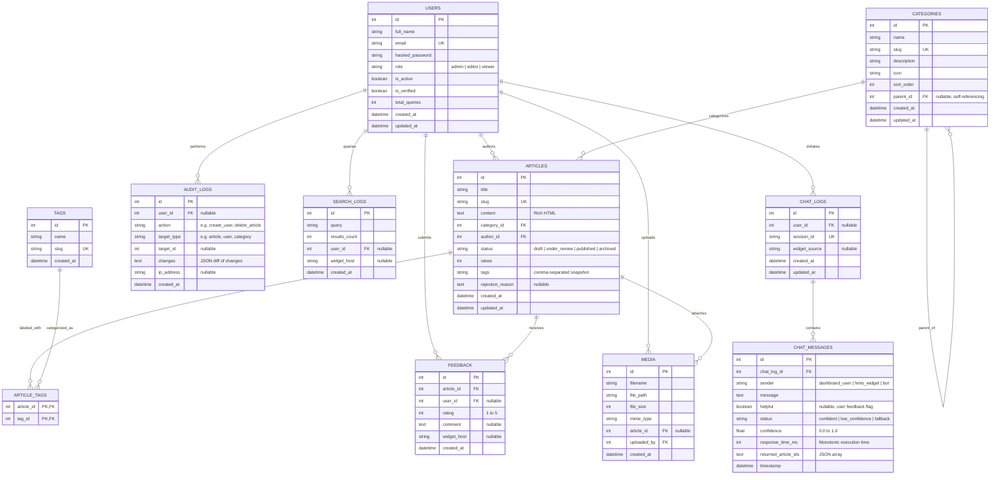

# HealthTech Knowledge Base — Entity Relationship Diagram (ERD)

## Scope & Schema Model

The HealthTech Knowledge Base data model supports:
- **Clinical Knowledge Base**: Articles with statuses (`draft`, `under_review`, `published`, `archived`), hierarchical categories, and many-to-many tags.
- **Editorial & Governance**: Rejection feedback, review queues, and reader satisfaction star ratings (`feedback`).
- **Identity & Access Management**: Users with hierarchical roles (`admin`, `editor`, `viewer`), verification status, and activity tracking.
- **Security & Administrative Auditing**: Non-repudiable audit logs (`audit_logs`) and search demand analytics (`search_logs`).
- **Conversational Decision Support**: Persisted chat logs and messages (`chat_logs`, `chat_messages`) with confidence scores, latency timing, source article citations, and helpfulness flags.

